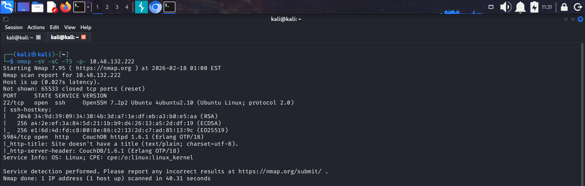
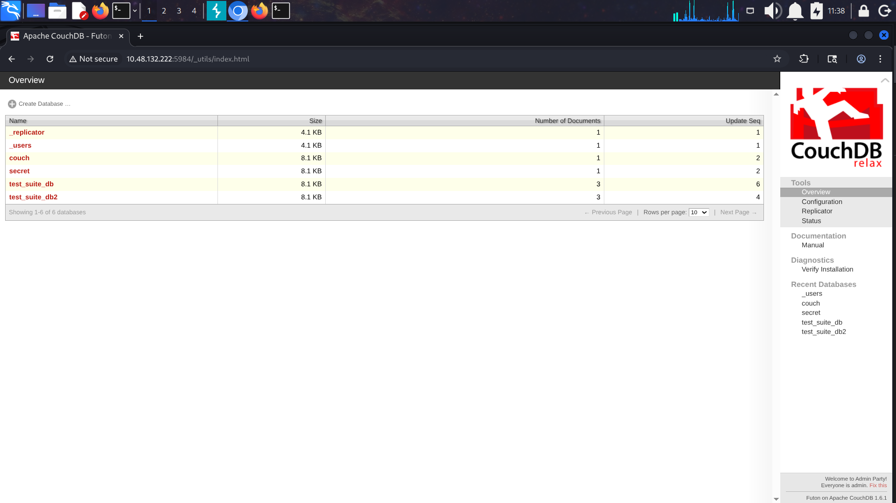
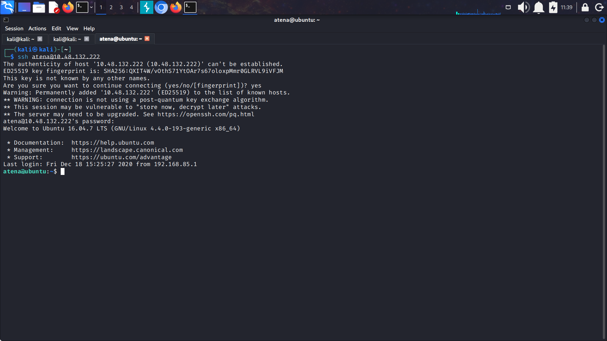
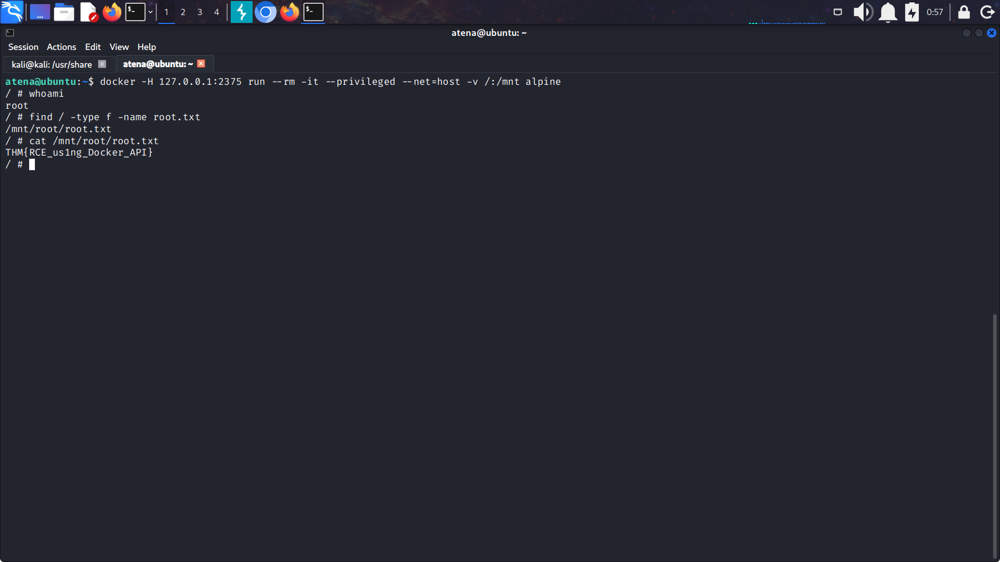

# Couch CTF Writeup
**Platform:** TryHackMe \
**Difficulty:** Easy \
**Category:** Web Exploitation / Privilege Escalation


---
## Reconnaissance
### Nmap Scan
Without Wasting any time I started scanning all the TCP ports with its Timing flag set to -T5 and  flags -sC and  -sV which will not leave any open ports and also run the default scripts on it
``` bash
nmap -sV -sC -T5 -p- 10.48.132.222
```     
  
         
We found two open port and also answer to Question 1
>Scan the machine. How many ports are open?=>2

The 2 ports open were port 22 (SSH) and port 5984 which was running the **CouchDB v1.6.1** which is a opensource NoSQL Database. 
>Scan the machine. How many ports are open?=>CouchDB
>What port is the database management system running on?>=5984        
### Web Enumeration
When I visited the CouchDB with url ```http://10.48.132.222:5984``` .         
 It gave us a JSON response : ```{"couchdb":"Welcome","uuid":"ef680bb740692240059420b2c17db8f3","version":"1.6.1","vendor":{"version":"16.04","name":"Ubuntu"}} ```
   
 I also tried directory enumeration using **Gobuster** but I was not able to find any directories
 Then after some research on internet about CouchDB we found out that it has directory **_utils** which is used for the Adminstration of Database using web and also there is a directory **_all_db** which lists down all databases. 
 >What is the path for the web administration tool for this database management system?>=_utils
 
 >What is the path to list all databases in the web browser of the database management system?>_all_dbs      
 

      
   
There were 6 databases in the system and without wasting any time I first visited the secret database and there was key which was having field named **passwordbackup** with value ``atena:t4qfzcc4qN##`` and no we got some credentials and also answer to the 6th question.   
>What are the credentials found in the web administration tool?>=atena:t4qfzcc4qN##

# Exploitation
### SSH Login
From the Credentials found from the database we will try to login in the system via SSH. After using the credentials we were sucessfully logged into the system with user **atena**.       


In the `/home/atena ` user's directory we find our first flag **user.txt**
>Compromise the machine and locate user.txt>=THM{1ns3cure_couchdb}

### Privilege Escalation
Now to escalte our privileges to root and  to get the *root flag*.   
So I started with running the command ``sudo -l``,  but told us that user atena could not any run any commands with root privileges.  
I also tried exploring SUID with  `find / -perm -4000 2>/dev/null`  also found nothing.
I also tried running ``linpeas.sh``, but it also gave nothing.
Then in the `/home/atena` I found a hidden file named ``.bash_history``. This file contained all the commands executed by user. After looking into file I found a docker command which was the key to getting the root privilege.   
The command was ``docker -H 127.0.0.1:2375 run --rm -it --privileged --net=host -v /:/mnt alpine``    
I ran this command and and we got access to the container. This container was having root privileges so i ran the find command to see if it have the  root.txt file:         
``find / -type f -name root.txt``       

 
And it found out the root.txt and and we also completed the challenge.
>Escalate privileges and obtain root.txt>=THM{RCE_us1ng_Docker_API}

## Conclusion
The TryHackMe Couch machine highlights that insecure default configurations, such as unprotected databases and exposed Docker sockets, are primary vectors for system compromise. The exercise emphasizes the risks of storing plaintext credentials and the critical importance of secure, hardened configurations over solely patching vulnerabilities.
