# Sustah CTF Writeup
**Platform:** TryHackMe \
**Difficulty:** Medium \
**Category:** Web Exploitation / Privilege Escalation


---
## Reconnaissance
#### Nmap Scan
Started the box and did the Nmap Scan to check which ports all ports are open.       
```
nmap -T5 -p- sustah.thm
```
Then after finding all open ports, I ran the nmap again on open ports  with default scripts and for finding Service Detection.      
```
nmap -T5 -sV -sC -p22,80,8085 sustah.thm
```      
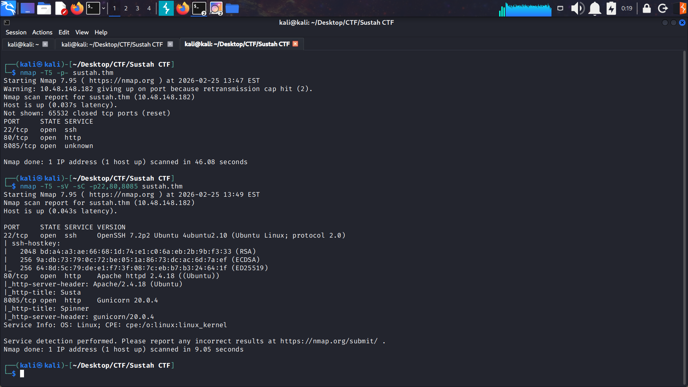       

From Scan we identified 3 Ports Open:

 - **SSH** : Port 22
 - **Web Servers**: Port 80 & 8085    

#### Web Enumeration
I started to visit the webpages. The website on **Port 80** was static site which didn't give any valuable information to us.
I also did **Directory Enumeration** using **Gobuster** on the site at Port 80 but it didn't help me as I didn't find any directory's.        

Then I visited the website at **Port 8085**. It was a game which was telling to guess the number from the spinning wheel. It was telling us that ***Feeling lucky? Guess the right number. You have a 0.004% chance of winning.***        

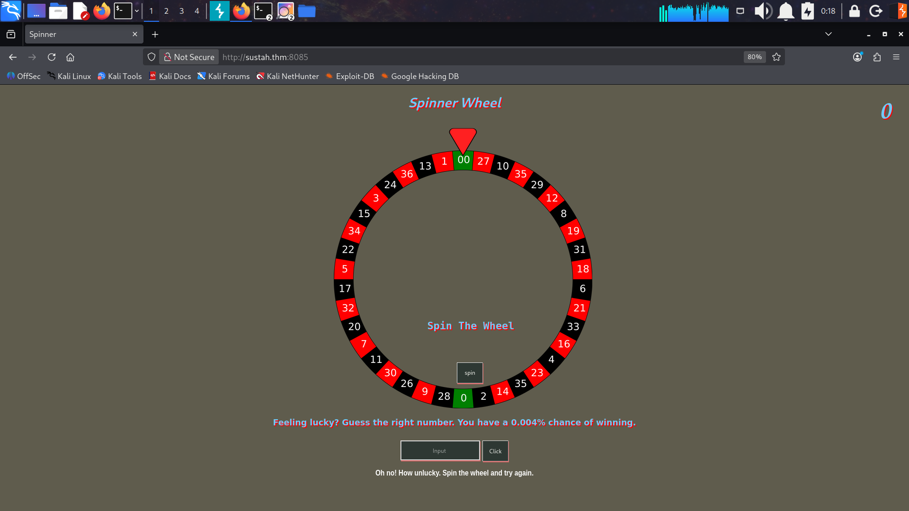

When I spinned the wheel it immediately gave us message that 
***"Oh no! How unlucky. Spin the wheel and try again."*** before even guessing the number. This got me to that something is suspicious. Tryhackme's also had question about a number which will reveal the path. From this hint I came to know that we have to find the number. So I started **brute forcing** the number field. I first captured the request in Burp to make a custom python script to brute force the number feild.    
**Request:**

```
POST / HTTP/1.1
Host: sustah.thm:8085
User-Agent: Mozilla/5.0 (X11; Linux x86_64; rv:84.0) Gecko/20100101 Firefox/84.0
Accept: text/html,application/xhtml+xml,application/xml;q=0.9,image/webp,*/*;q=0.8
Accept-Language: en-US,en;q=0.5
Accept-Encoding: gzip, deflate
Content-Type: application/x-www-form-urlencoded
Content-Length: 11
Origin: http://10.10.95.187:8085
Connection: close
Referer: http://10.10.95.187:8085/
Upgrade-Insecure-Requests: 1

number=10000
```     
I wrote a custom **Python** script to brute force the number field.  But after running this script we didn't found anything. After certain requests the response code was changed to 429. 
This was some error. So I went back to **Burpsuite** and sent a request. I found that some Rate limiting is implemented.    
    
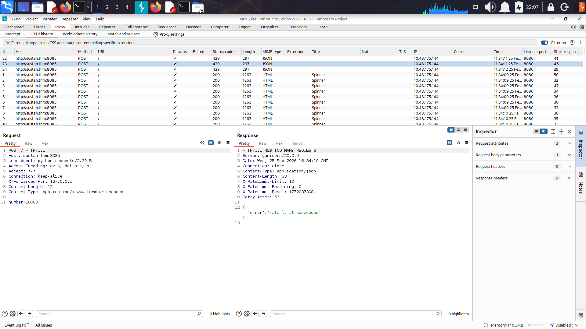  
  
So i went to [**HackTricks - Rate Limit Bypass**](https://book.hacktricks.xyz/pentesting-web/rate-limit-bypass) to see if I can find some way to bypass the rate limiting. I found that by adding these  **Headers**  "X-Originating-IP: 127.0.0.1, X-Forwarded-For: 127.0.0.1, X-Remote-IP: 127.0.0.1, X-Remote-Addr: 127.0.0.1, X-Client-IP: 127.0.0.1, X-Host: 127.0.0.1 & X-Forwared-Host: 127.0.0.1" we can bypass the rate limiting.         
So i again wrote a [**Python Script**](script.py) to brute force the number and evade the rate limiting by adding these headers into the request. Also I brute force the number from 10000 to 30000 as the answer feild was asking for number with 5 digits.  After running it I was successfully able to find the number which was the correct guess to the game.        

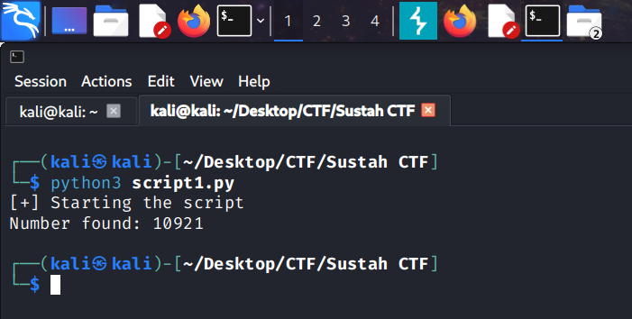    

>What is the number that revealed the path?>= **10921**

Now in the website I entered the number and we got the path to a hidden directory.        

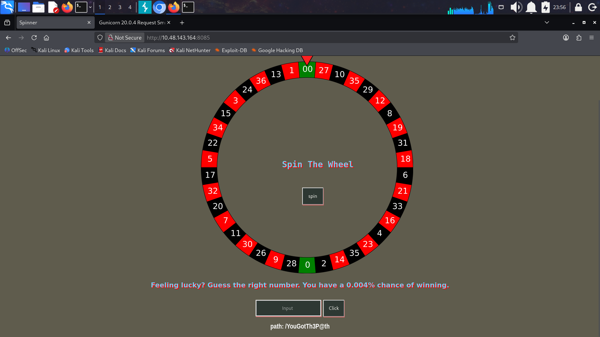

>Name the path.>= **/YouGotTh3P@th/**


After This I visited the path on the web server with port 8085, but it was not present there. Then I visited the website with path at the Web server with Port 80.        
We found a **CMS** named **Mara CMS**.           
>Name the path.>=Mara            

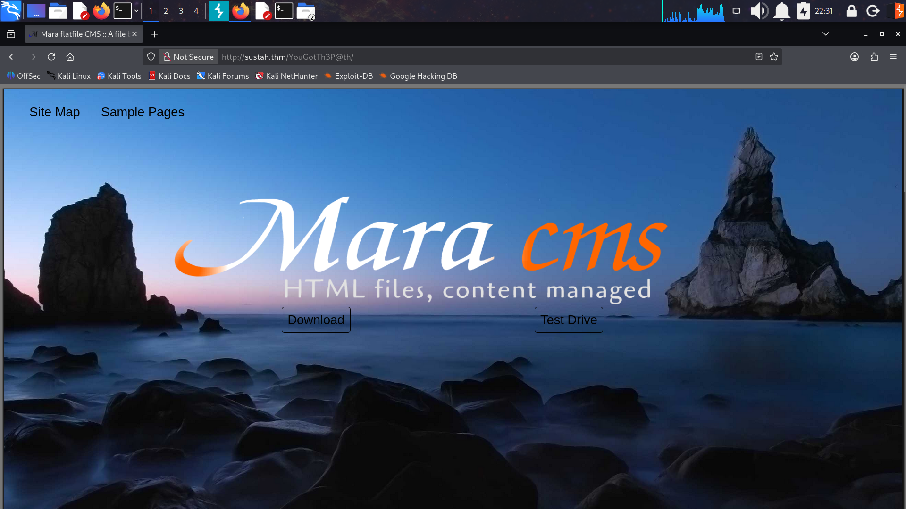


Then started to lookaround to the CMS website i found that the sitemap page which was revealing lots of other directory.
Then went to the `About page`. It revealed the version Mara to be 7.2 but it was not correct as I entered into the Tryhackme's Answer box. So I went to google and searched for "How to know Mara CMS version number?". I got to know that there's a file in the same main directory named /changes.txt. This gave me answer to the question:       
>What version of the CMS is running? = **7.5** 

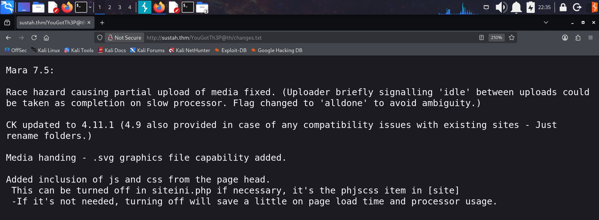

## Exploitation
#### Gaining RCE
I started exploring the website and when I clicked on Sample Pages it took me to page named `lorem.php` . On this page we got login **Credentials**``(admin:changeme)`` to the admin page of CMS. But the problem was  there wasn't a direct login page. So I search on internet and found that we add **login** parameter with value **admin**. This gave me option to add password into the page and then I was having the admin pirvilege of CMS.       
I also searched on Google about Marla CMS 7.5 and I came to know that there is **File Upload Vulnerability** which will to **RCE**.
Then I found the upload functionality at endpoint ``
codebase/dir.php?type=filenew
``  and uploaded the PHP Revershell into it.      

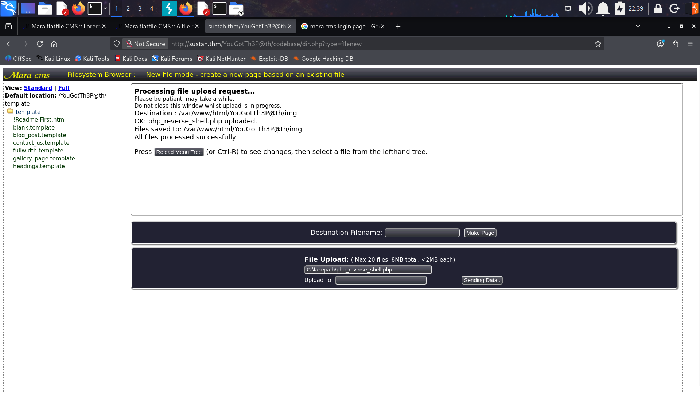

Then I started the listener on my attack machine and accessed the reverse shell at location  `/img` and I got the reverse shell.
We were the user **``www-data``**.  
      
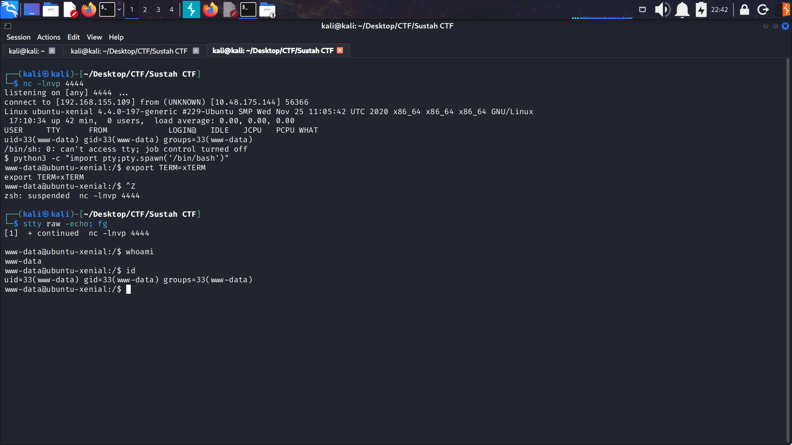

#### Privilege Escalation
Our first goal was to find the `user.txt` flag but it was readable by the use **`kiran`**. So tried finding ways to esacalate privilege, but found nothing. So I checked the hint to the question. It told to look for backups and suprisingly there was a directory named ``backups`` in the ``/var`` directory. On enlisting all the files with command ``ls -la`` we found a file named ``.bak.passwd`` and this contained the password for user kiran.          
Then we login with Kiran's credentials into his account and found the **user flag**.          

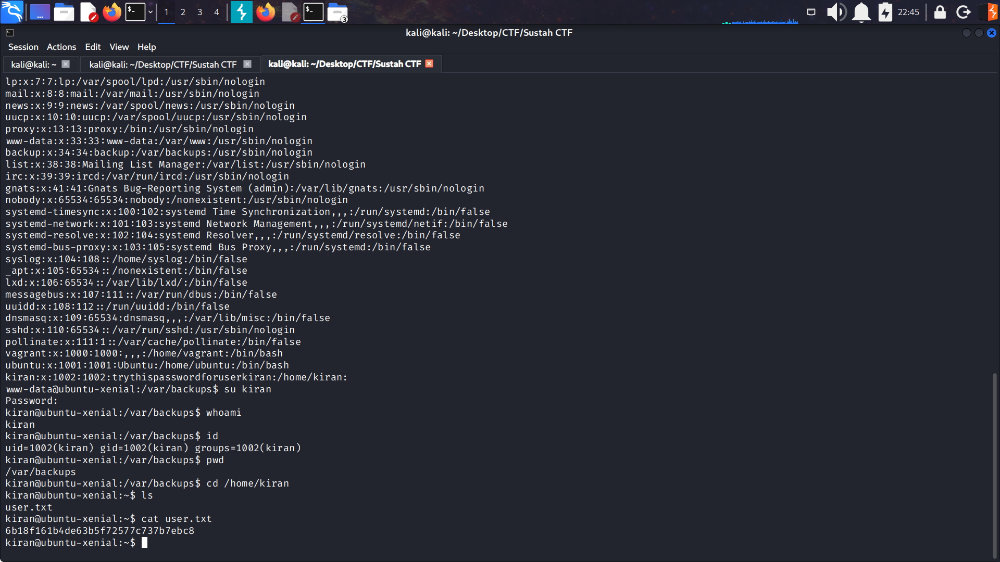          

>What is the user flag? = **6b18f161b4de63b5f72577c737b7ebc8**

Now our goal is to find the root flag.
So I ran **linpeas** and found a very vulnerable thing named **Doas**.   

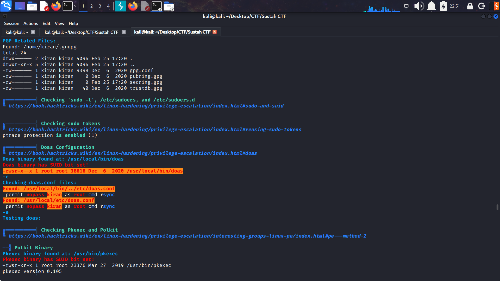

So basically we found out that user kiran could run `rsync` with root privileges using `Doas`.            
**Doas** is an alternative to `sudo`.
So i went to ``**GTFObin**`` and found out that we can get root privileges using the command:      
``sudo rsync -e 'sh -c "sh 0<&2 1>&2" 127.0.0.1:/dev/null``
Here we just have to replace sudo with `doas`                
Then we ran the command: ``doas rsync -e 'sh -c "sh 0<&2 1>&2" 127.0.0.1:/dev/null`` and we got the root privileges.
Then I went to `/root` directory I got the **Root flag**          
>What is the root flag? = **afbb1696a893f35984163021d03f6095**

Finally the Challenge is Completed

## Conclusion
This CTF Challenge thought lots of thing that Rate Limiting Techniques can also be bypassed adding some headers.  So we should apply more harder rate limiting techniques. Also leaving Applications on Default Credentials is major problem which is being highlighted by the challenge. This challenge also used doas for privilege esaclation instead of using sudo most of challenge use. It was proper challenge where by chaining vulnerablities we could gain full access to Server. 
